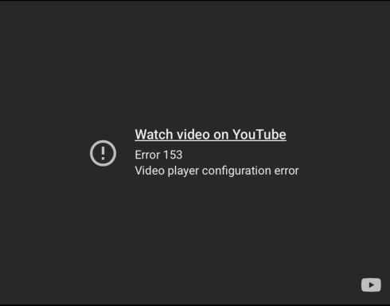

If you embed YouTube videos on a website or app, there's a good chance they might have broken recently. Instead of the player, you now see this:



> **Video Unavailable**
> Error 153 — Video player configuration error

YouTube now requires embedded players to specify an `HTTP Referer` header identifying the site doing the embedding. If your page's `Referrer-Policy` strips that header on cross-origin requests, or you don't explicitly provide that header in your request, YouTube will refuse to play the video and returns error 153.  

<div class="note">
  <strong>Note: </strong>YouTube changed their enforcement of this policy sometime in 2025, which is why these embeds are breaking now. Most of the forum threads about it date to late 2025.
</div>

### `same-origin` vs `strict-origin-when-cross-origin`

Most framework defaults and guides will set the Referrer policy of your site to `same-origin`. This policy will cause embeds to fail as `same-origin` is same-origin **only**. As youtube.com is a cross-origin destination from your site, the browser under this policy sends *no* `Referer` header at all on the request. YouTube sees an empty Referer and returns a 153.

There are two paths to fix this problem, depending on the environment you're working in. 

### 1. Website in a Browser

For a normal website, all you need to do is set the Referrer Policy header to `strict-origin-when-cross-origin` . This can be done at any level (per iframe, site-wide, server/CDN level) depending on your project and security needs.

If you're using an `iframe` :
```html
<iframe
  src="https://www.youtube.com/embed/VIDEO_ID"
  referrerpolicy="strict-origin-when-cross-origin"
  allowfullscreen>
</iframe>
```

Site-wide via the response header (ex. in Django):
```python
SECURE_REFERRER_POLICY = "strict-origin-when-cross-origin"
```

Web Server/CDN level:
```
Referrer-Policy: strict-origin-when-cross-origin
```
With this policy set, the browser will send the origin of your site (e.g. `https://yoursite.com`) as the `Referer` on cross-origin requests. That's enough for YouTube to identify the embedding site, and since it's just sending the origin without path or query params, there's no risk of leaking anything sensitive that might be in the rest of the URL.

### 2. Native App WebView (SwiftUI, Android, etc)

WebViews are trickier as you aren't in a browser, so there's no "page" in the normal web sense for the request to Refer back to. In this context, I resolved the error by constructing my own Request and appending the `Referer` header myself. 

The example here is in Swift, but should be generally applicable to non-browser use cases.

```swift
var request = URLRequest(url: youtubeEmbedURL)
request.setValue("https://your-app-domain.com", forHTTPHeaderField: "Referer")
webView.load(request)
```

<div class="note">
  <strong>Note:</strong> While the YouTube docs say the URL should be a valid identifier registered
  with your app or project, they don't appear to be enforcing this yet. For
  testing and development you can use any domain, but switch to something
  valid before shipping.
</div>

If you're interested in more details about this, Simon Willison <a href="https://simonwillison.net/2025/Dec/1/youtube-embed-153-error/" target="_blank">wrote a great post on the same bug</a>. You can also check out the Google Developer articles on the <a href="https://developers.google.com/youtube/terms/required-minimum-functionality" target="_blank">Referer requirement</a> and the <a href="https://developers.google.com/youtube/iframe_api_reference" target="_blank">Error 153 specification</a>.